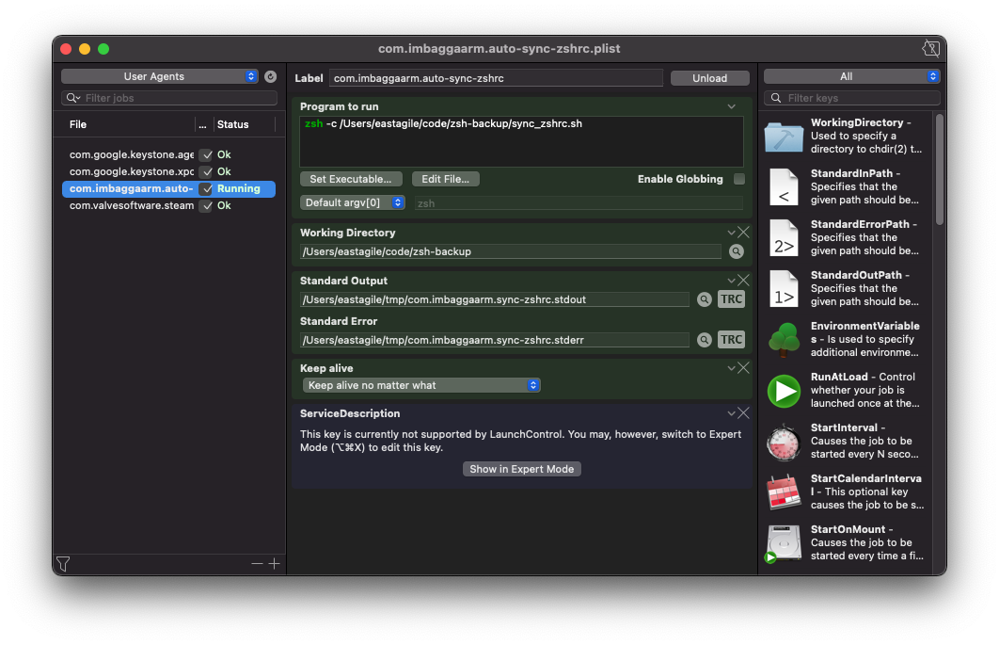

# ZSH Run Configuration Auto Sync
This repository will help you to utilize `fswatch` and `launchd` in order to get your ZSH run configuration (.zshrc) synced with the git remote repository automatically.

If you want to deeply understand how it works, you should read this article: [Medium - Organize and Auto Back Up Your ZSH Run Configuration](https://medium.com/@imbaggaarm/organize-and-auto-back-up-your-zshrc-files-to-github-364a262b3227)

## Quick Start
Follow these steps to automatically sync your `.zshrc` with the remote repository.

1. **Install required tools**
    
    fswatch: For detecting file changes, install it using Homebrew
    ```
    brew install fswatch
    ```
2. **Create git repository**
    ```shell
    mkdir ~/code && mkdir ~/code/zsh-backup && cd ~/code/zsh-backup
    git init
    gh repo create
    ```
    Notes: If you haven't installed `github command-line` tool yet, please use:
    ```shell
    brew install gh
    ```
    Remember to set the repo's visibility to **Private**.
3. **Copy necessary files**
    1. You should clone this repository and copy 3 files into `zsh-backup` folder:
        - [commit_changes.sh](./commit_changes.sh)
        - [sync_zshrc.sh](./sync_zshrc.sh)
        - [com.imbaggaarm.auto-sync-zshrc.plist](./com.imbaggaarm.auto-sync-zshrc.plist)
    2. Make scripts executable:
        ```shell
        chmod +x commit_changes.sh && chmod +x sync_zshrc.sh
        ```
    3. Modify fswatch absolute path:
        - Use `which fswatch` to get the absolute path of `fswatch` and replace `/opt/homebrew/bin/fswatch` in `sync_zshrc.sh` with the result.
4. **Verify the scripts**
    1. Navigate the `zsh-backup` directory
        ```shell
        cd ~/code/zsh-backup
        ```
    2. Run `sync_zshrc.sh`
        ```shell
        ./sync_zshrc.sh
        ```
    3. Change the content of `~/.zshrc` or `~/.zsh/` and check whether new changes are committed and pushed to the remote repository.

5. **Modify launchd property list file (com.[username].auto-sync-zshrc.plist)**
    1. Replace `imbaggaarm` with the username in your local machine.
    2. Replace `/Users/eastagile/` to the home directory of your logged in user.
    
        Notes: For **StandardOutPath** and **StandardErrorPath** in the **.plist**, you can use whatever you want, but please remember to make sure that the paths are existed (create if they are not) and your user has enough permissions to modify the files.
6. **Make sync_zshrc run as a background service**
    1. Copy `com.<username>.auto-sync-zshrc.plist` to `~/Library/LaunchAgents/`:
        ```shell
        cp com.<username>.auto-sync-zshrc.plist ~/Library/LaunchAgents/
        ```
    2. Navigate to `~/Library/LaunchAgents/` and start the service:
        ```shell
        launchctl load com.<username>.auto-sync-zshrc.plist
        ```
        - If you get `Load failed: 5: Input/output error`, please check if the **.plist** file is in the correct format and you are in the right directory.
    3. You can check files at `StandardErrorPath` and `StandardOutPath` to debug if there is anything wrong. In that case, I suggest you use LaunchControl for easier debugging. You can install it using Homebrew Cask:
        ```shell
        brew install --cask launchcontrol
        ```
    4. If you open the LaunchControl application and see all fields are green in `com.<username>.auto-sync-zshrc.plist` then congratulations, now all of your ZSH run configurations are synced automatically with the remote repository. Example:
    
    Notes: Remember to select `UserAgents` in the top left button of the LaunchControl application.
7. **Verify that our scripts are working properly**
    - Change `~/.zshrc` or `~/.zsh/` and verify that our changes are committed and pushed automatically to the remote repository.

## Tokens, Credentials, Secrets
- You should store your private tokens, secrets in other files, such as `secrets.sh`, and load them by adding `source secrets.sh` into `.zshrc` file. Even though our repository is private, but you might accidentally publish it or in case Github is hacked, your credentials won't be leaked.